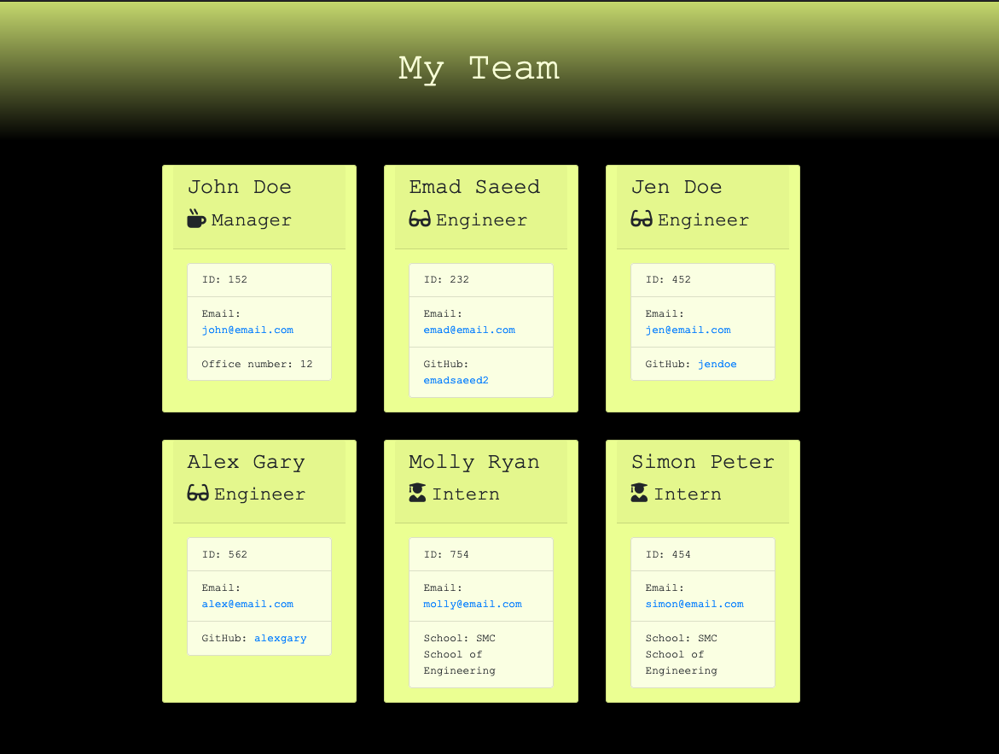

# Team Webpage Generator

## Overview

This application takes in information about employees on a software engineering team, then generates an HTML webpage that displays summaries for each person. When a user decides to finish building their team then they exit the application, and the HTML is generated.

## User Story

As a manager a user want to generate a webpage that displays my team's basic info so that a user have quick access to their emails and GitHub profiles.

---

## Mock-Up

The following image shows a mock-up of the generated HTML’s appearance and functionality:

---

## Links

- [Github code link](https://github.com/EmadSaeed2/webpage-generator).
- [Github live generated page link](https://emadsaeed2.github.io/webpage-generator).